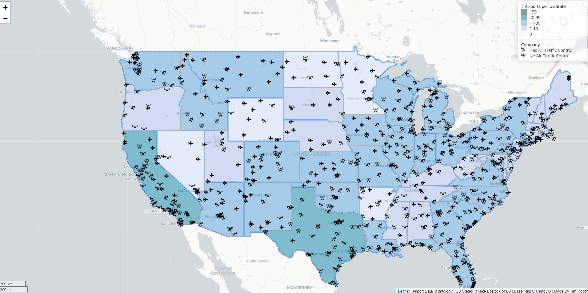

# Mapping US Airports by State

## Introduction

This choropleth web map displays the locations of airports across the United States, along with a visualization of the number of airports per state.

## Primary function

The primary function of this web map is to give viewers a sense of how airports are distributed throughout the United States. From the map, we can visualize certain areas of the country that have a significant amount of airports, and other regions that only have a few. By doing this, we can get a sense of where in the country plane transportation can occur. This includes identifying areas that are accessible by air.

Additionally, the web map differentiates between airports that have air traffic control and those that do not. The purpose of having this feature is so that viewers can identify how much infrastructure is in place to support the particular airport they are viewing. Airports that have air traffic control likely face more traffic than those that do not have it. Airports that do not have air traffic control may be private and operate on a much smaller scale than those that do.

## Libraries used

- Leaflet.js
- Font Awesome
- Google Fonts
- Ajax
- JQuery

### Acknowledgements

This web map displays the locations of US airports contained within a dataset found on data.gov. You can view the original dataset here: https://catalog.data.gov/dataset/usgs-small-scale-dataset-airports-of-the-united-states-201207-shapefile

Additionally, the geoJson data used to create the state boundaries originated from Mike Bostock of D3.

Lastly, much of the code used to create this web map was modified from a web map created by Professor Bo Zhao.
