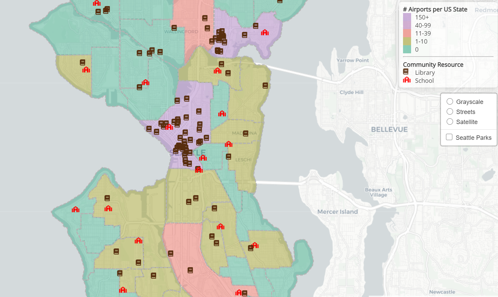

# Mapping Community Resources in Seattle School Districts

Click [here](https://tmroach.github.io/library-distribution-seattle-school-districts/) to view the web map.

## About

This web map primarily shows the density of libraries for each elementar school district within the Seattle public school system. Additionally, the locations of both libraries and local community centers are plotted on the map. Users may also select to view the 'Seattle Parks' layer, which shows how city parks are distributed throughout the school districts.

## Project Goal

The main purpose of this web map is to display local community resources in relation to each attendance boundary zone. By viewing this map, the hope is that viewers will get a better sence of where in their community these resources are located, and help Seattle residents understand where other resources are beyond their immediate community. Additionally, this map could assist young families who are deciding where in the city they'd like to live. Understanding the size of each school district, the amount of parks in their neighborhood, and where libraries and community centers are located could be important to them.

# Extensions

This project began with the intention of understanding how each attendance boundary zone has performed on standardized tests such as the SBA. However, data was not easy to find regarding the performance of each zone, or was not readily accessible to the public. In the future, it would be interesting to visualize this to get a better understanding of each school district.

## Data Resources

Washington Library Locations: [Washington Geospatial Open Data](https://geo.wa.gov/datasets/washington-library-locations?geometry=-127.779%2C45.964%2C-113.903%2C48.572&showData=true)
`Note: some values were removed from the dataset so that only libraries that were within the Seattle city limits were shown.`

Community Center Locations: [Seattle Parks and Recreation Open Data](https://data.seattle.gov/Parks-and-Recreation/Seattle-Parks-and-Recreation-GIS-Map-Layer-Shapefi/q59g-r5pd)

Seattle Park Boundaries: [Seattle Parks and Recreation Open Data](https://data.seattle.gov/Parks-and-Recreation/Seattle-Parks-and-Recreation-GIS-Map-Layer-Shapefi/ptpk-refv)

Seattle Public Schools Elementary Attendance Boundaries: [Seattle Public Schools GIS Data](https://www.seattleschools.org/departments/enrollment_planning/enrollment_data/maps)

## Applied Libraries

- Awesome Font
- Leaflet.js
- Carto for basemaps
- GitHub pages for project hosting

## Acknowledgment

This project was made possible with the help of web mapping templates provided by Professor Bo Zhao and Tyler McCrea of the University of Washington.
